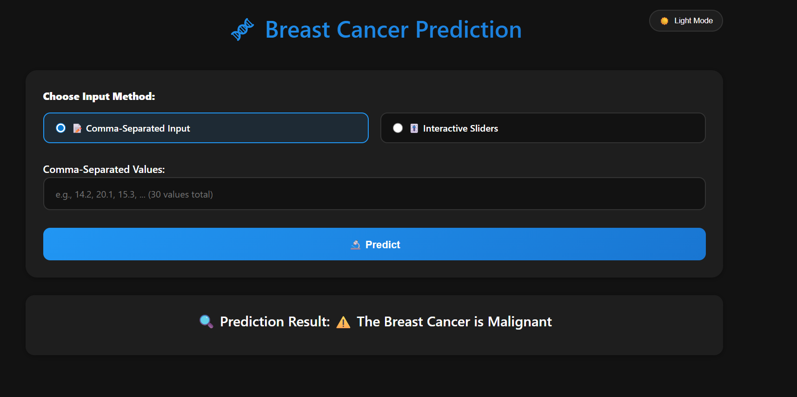

# Breast Cancer Prediction Web App

This project is a simple machine learning web application built using **Flask**. It allows users to predict whether a tumor is **benign** or **malignant** based on medical features from the breast cancer dataset.

## 🔍 Features

- Trained Logistic Regression model on the Breast Cancer dataset from `sklearn`.
- Web interface using HTML and CSS.
- Allows user input through form fields to get prediction.

## 📁 Project Structure

```

breast-cancer-predictor/
│
├── templates/
│   └── index.html          # Frontend form for user input
│
├── app.py                  # Flask backend serving the web app
├── model.py                # Code to train and save the model
├── breast\_cancer\_model.pkl # Trained machine learning model
├── requirements.txt        # Python dependencies
└── README.md               # Project documentation

````

## 🚀 Getting Started

### 1. Clone the Repository

```bash
git clone https://github.com/tirthosaha69/breast-cancer-diagnosis-ml.git
cd breast-cancer-predictor
````

### 2. Create Virtual Environment (optional but recommended)

```bash
python -m venv venv
source venv/bin/activate     # On Windows: venv\Scripts\activate
```

### 3. Install Dependencies

```bash
pip install -r requirements.txt
```

### 4. Train the Model

If you haven't already trained the model, run:

```bash
python model.py
```

This will generate `breast_cancer_model.pkl`.

### 5. Start the Flask App

```bash
python app.py
```

Then, open your browser and go to:
[http://127.0.0.1:5000](http://127.0.0.1:5000)

## 🧠 Model Information

* **Algorithm**: Logistic Regression
* **Dataset**: Breast Cancer Wisconsin Dataset (from `sklearn.datasets`)
* **Accuracy**: \~95% on test data

## 📷 Screenshot



## 📌 To-Do

* Add model metrics display on the page.
* Improve CSS styling.
* Deploy to platforms like Heroku or Render.

## 📝 License

This project is open-source and available under the [MIT License](LICENSE).

---
